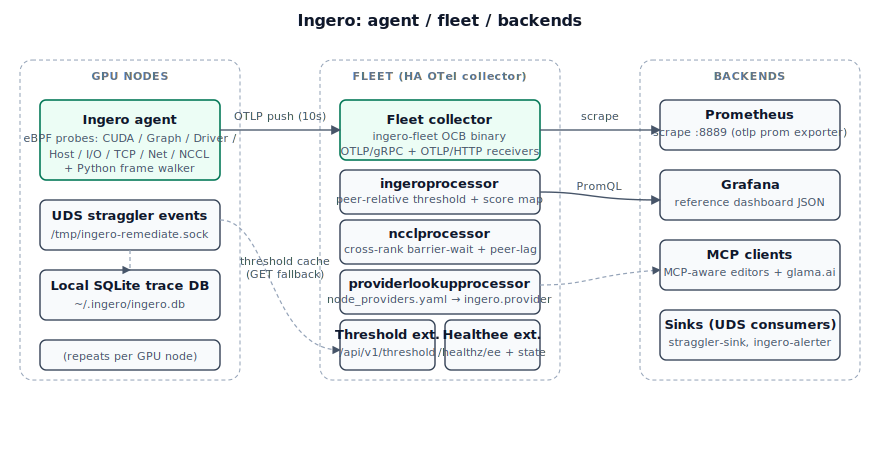

# Multi-node GPU cluster quickstart (Ingero Fleet)

Ingero is a single-node agent. To detect cluster-wide stragglers in real time
(rather than fanning queries out across nodes after the fact), pair the agent
with the **Ingero Fleet collector** — a small custom OpenTelemetry Collector
distribution that aggregates per-node health scores and computes a peer-relative
threshold the agents read back.

This page is the multi-node entry point that used to live in the agent README.
The agent README now stays single-node-focused; everything cluster-shaped is
collected here.

## Architecture

The agent runs per-GPU-node and emits OTLP to a single Fleet collector replica
(or HA fleet behind a consistent-hash load balancer). Fleet handles
peer-relative threshold computation, NCCL cross-rank barrier-wait derivation,
and cost-of-problem enrichment; Prometheus / Grafana / MCP read from Fleet,
never the agent. UDS straggler events flow to local sinks (`straggler-sink`,
`ingero-alerter`) for remediation.

## Deployment guides

Three multi-node quickstart guides take you from zero to a detected straggler
on three GPU hosts in about 20 minutes. Pick the deployment style that matches
your environment:

- [Kubernetes (Helm)](https://github.com/ingero-io/ingero-fleet/blob/main/docs/quickstart-k8s_fleet.md)
- [Bare-metal binary](https://github.com/ingero-io/ingero-fleet/blob/main/docs/quickstart-binary_fleet.md)
- [Docker](https://github.com/ingero-io/ingero-fleet/blob/main/docs/quickstart-docker_fleet.md)

See [`quickstart_fleet.md`](https://github.com/ingero-io/ingero-fleet/blob/main/docs/quickstart_fleet.md)
in the fleet repo for a one-page comparison if you are not sure which to pick.

## Why use Fleet vs. just `ingero query --nodes`?

The agent has a built-in multi-node `query --nodes` fan-out (covered in the
[main README's `ingero query` section](../README.md#ingero-query)). That
queries every node's local SQLite ad hoc and merges results in the CLI.

Use Fleet when you want the cluster itself to classify stragglers in real time
— the agent reads back the cluster-wide threshold over OTLP response headers
and fires a `straggler` event the moment its local health score falls below
the cluster's peer-relative band. The agent runs the `ingero fleet-push`
subcommand alongside `ingero trace --record`; see
[`docs/push_fleet.md`](push_fleet.md) for the command reference.

## Cluster-wide remediation

Multi-node remediation protocol (PoC, experimental) is documented in
[`docs/remediation-protocol_fleet.md`](remediation-protocol_fleet.md).
