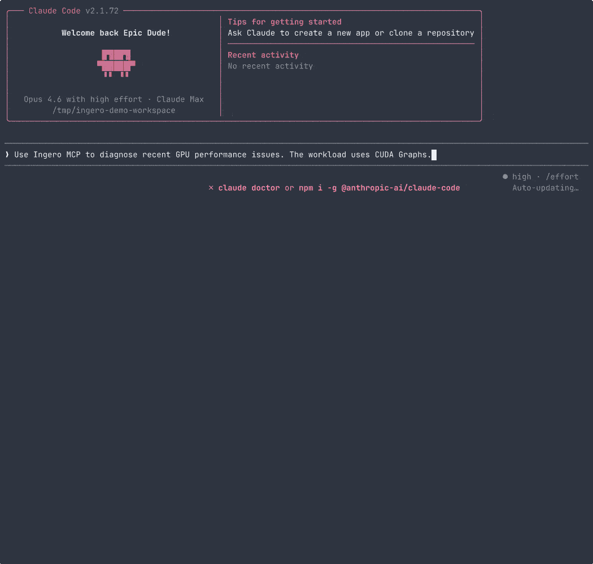

# GPU Investigation Trace Data

Real-world GPU performance investigations traced with Ingero. Each `.db` file is a SQLite database containing CUDA API call timings, host kernel events, and causal chain analysis.

## Databases

| File | Issue | What It Shows |
|------|-------|---------------|
| `pytorch-dataloader-starvation.db` | [pytorch/pytorch#154318](https://github.com/pytorch/pytorch/issues/154318) | PyTorch DataLoader 114x slower than direct indexing. 200K+ context switches, GPU starving for data. |
| `vllm-37343-logprobs-amplification.db` | [vllm-project/vllm#37343](https://github.com/vllm-project/vllm/issues/37343) | vLLM n_completions + logprobs blocks all co-scheduled requests for 11+ seconds. 80% kernel throughput drop. |
| `pytorch-173382-empty-cache.db` | [pytorch/pytorch#173382](https://github.com/pytorch/pytorch/issues/173382) | `torch.cuda.empty_cache()` not freeing memory. cudaFree p99=1.9ms, cudaMemcpyAsync 98.6x slowdown from CPU scheduling. |
| `vllm-37308-hol-blocking.db` | [vllm-project/vllm#37308](https://github.com/vllm-project/vllm/issues/37308) | vLLM head-of-line blocking with prefix caching. 14.5x TTFT regression. Available as [release asset](https://github.com/ingero-io/ingero/releases). |
| `cuda-graph-cpu-contention.db` | CUDA Graph + CPU contention | `torch.compile` inference with batch size change triggering graph re-capture under CPU contention. 71% graph launch rate drop, 33x cudaLaunchKernel p99 blowup. CUDA Graph lifecycle events (capture, instantiate, launch) with causal correlation. **Captured 2026-04-02 04:38–04:39 UTC** (~50s window, 147K events). When using `--since`, note that event timestamps are from this date — use `--since 24h` or a wide window if querying after the capture date. |

## Investigate with AI (copy & paste)

Pick a database and run. Type `/investigate` when prompted to start a guided investigation.

**PyTorch DataLoader starvation** ([pytorch/pytorch#154318](https://github.com/pytorch/pytorch/issues/154318)):
```bash
cat > /tmp/ingero-mcp.json << 'EOF'
{"mcpServers":{"ingero":{"command":"./bin/ingero","args":["mcp","--db","investigations/pytorch-dataloader-starvation.db"]}}}
EOF
ollmcp -m minimax-m2.7:cloud -j /tmp/ingero-mcp.json
```

**PyTorch empty_cache leak** ([pytorch/pytorch#173382](https://github.com/pytorch/pytorch/issues/173382)):
```bash
cat > /tmp/ingero-mcp.json << 'EOF'
{"mcpServers":{"ingero":{"command":"./bin/ingero","args":["mcp","--db","investigations/pytorch-173382-empty-cache.db"]}}}
EOF
ollmcp -m minimax-m2.7:cloud -j /tmp/ingero-mcp.json
```

**vLLM logprobs amplification** ([vllm-project/vllm#37343](https://github.com/vllm-project/vllm/issues/37343)):
```bash
cat > /tmp/ingero-mcp.json << 'EOF'
{"mcpServers":{"ingero":{"command":"./bin/ingero","args":["mcp","--db","investigations/vllm-37343-logprobs-amplification.db"]}}}
EOF
ollmcp -m minimax-m2.7:cloud -j /tmp/ingero-mcp.json
```

**CUDA Graph + CPU contention** (v0.9.0 demo):
```bash
cat > /tmp/ingero-mcp.json << 'EOF'
{"mcpServers":{"ingero":{"command":"./bin/ingero","args":["mcp","--db","investigations/cuda-graph-cpu-contention.db"]}}}
EOF
ollmcp -m minimax-m2.7:cloud -j /tmp/ingero-mcp.json
```

Swap `minimax-m2.7:cloud` for any Ollama model (`qwen3.5:cloud`, `llama3.3`, etc.), or use Claude Desktop / Cursor by adding the `mcpServers` block to your MCP config.

### Example questions after `/investigate`

- "What was the core reason for the GPU stall?"
- "Which CUDA operation was hit the hardest?"
- "Show me the causal chains"
- "Run SQL: SELECT op, COUNT(*), AVG(duration_ns)/1000 as avg_us FROM events GROUP BY op ORDER BY avg_us DESC"

## Quick Analysis (no MCP needed)

> **Note on `--since`:** The `--since` flag filters by wall-clock time relative to *now*, not the capture time. For saved databases, use a wide window (e.g. `--since 8760h` for 1 year) or omit it if your version supports that. The CUDA Graph demo DB was captured on 2026-04-02 ~04:38 UTC.

```bash
# View causal chains
ingero explain --db investigations/pytorch-dataloader-starvation.db --since 8760h

# Per-process GPU API breakdown
ingero explain --db investigations/pytorch-dataloader-starvation.db --per-process --since 8760h

# Query raw events
ingero query --db investigations/pytorch-dataloader-starvation.db --since 8760h --op cudaMemcpyAsync

# CUDA Graph demo — causal chains including graph correlation
ingero explain --db investigations/cuda-graph-cpu-contention.db --since 8760h
```

## Demo Recordings

GIF recordings from the CUDA Graph demo (v0.9.0), located in `docs/assets/`:

### `ingero trace` — live GPU event streaming with CUDA Graph correlation


### `ingero explain` — causal chains + `ingero query` for graph events


### AI investigation via MCP — Claude Code using Ingero tools


Editable `.cast` source files are in `docs/demo-recordings/`.

## Reproduction

**CUDA Graph demo** (requires any NVIDIA GPU + PyTorch 2.x):
```bash
# 1. Run the demo workload
python tests/workloads/cuda_graph_demo.py &

# 2. Add CPU contention
stress-ng --cpu 2 --timeout 30s &

# 3. Trace with Ingero
sudo ingero trace --pid $(pgrep -f cuda_graph_demo) --db demo.db --duration 30s

# 4. Investigate
sudo ingero explain --db demo.db

# 5. AI investigation (Claude Code + MCP)
claude mcp add -s local ingero -- sudo ingero mcp --db demo.db
claude
# Then ask: "Use ingero tools to investigate this GPU trace"
```

## Environment

All traces captured on TensorDock RTX 4090 (24GB), Ubuntu 22.04, kernel 5.15, NVIDIA driver 570.211.01.
- PyTorch investigation: PyTorch 2.10.0+cu128
- vLLM investigations: vLLM 0.17.1, Qwen/Qwen2.5-0.5B-Instruct with prefix caching
- CUDA Graph demo: EC2 g4dn.xlarge (Tesla T4, 15GB), Ubuntu 24.04, kernel 6.17, NVIDIA 580.126.09, PyTorch 2.10+CUDA 12.0

## Multi-Node Investigation Walkthrough

A complete example: diagnosing a distributed training stall across a 4-node GPU cluster using every multi-node feature. Sample databases are in the [Multi-Node Investigation Samples](#multi-node-investigation-samples) section below.

### Setup: Tag Each Node

On each node, trace with a node identity. Rank is auto-detected from `torchrun` environment variables (`RANK`, `LOCAL_RANK`, `WORLD_SIZE`).

```bash
# Node 1 (rank 0)
sudo ingero trace --node gpu-node-01

# Node 2 (rank 1)
sudo ingero trace --node gpu-node-02

# Node 3 (rank 2)
sudo ingero trace --node gpu-node-03

# Node 4 (rank 3)
sudo ingero trace --node gpu-node-04
```

Events are tagged with node identity and rank. Event IDs are node-namespaced (`gpu-node-01:1`, `gpu-node-01:2`, ...) to prevent collisions.

### Step 1: Start Dashboards for Fleet Queries

On each node, start the dashboard API (plain HTTP on trusted VPC):

```bash
ingero dashboard --no-tls --addr :8080
```

Or configure once in `ingero.yaml`:

```yaml
fleet:
  nodes:
    - gpu-node-01:8080
    - gpu-node-02:8080
    - gpu-node-03:8080
    - gpu-node-04:8080
```

### Step 2: Fan-Out Query - Find the Straggler


From any node, query the entire cluster with one command:

```bash
$ ingero query --nodes gpu-node-01:8080,gpu-node-02:8080,gpu-node-03:8080,gpu-node-04:8080 \
    "SELECT node, source, count(*) as cnt, avg(duration)/1000 as avg_us FROM events GROUP BY node, source"

node              node           source  cnt    avg_us
----------------  -------------  ------  -----  ------
gpu-node-01:8080  gpu-node-01    4       11009  5.2
gpu-node-01:8080  gpu-node-01    3       847    18400
gpu-node-02:8080  gpu-node-02    4       10892  5.1
gpu-node-02:8080  gpu-node-02    3       412    2100
gpu-node-03:8080  gpu-node-03    4       10847  5.3
gpu-node-03:8080  gpu-node-03    3       398    1900
gpu-node-04:8080  gpu-node-04    4       10901  5.0
gpu-node-04:8080  gpu-node-04    3       421    2200

  8 rows from 4 node(s)
```

Node 1 has 847 host events with 18.4ms average duration - much higher than the other nodes (~2ms). That's the straggler.

### Step 3: Fan-Out Explain - Cross-Node Causal Chains


```bash
$ ingero explain --nodes gpu-node-01:8080,gpu-node-02:8080,gpu-node-03:8080,gpu-node-04:8080

FLEET CAUSAL CHAINS - 2 chain(s) from 4 node(s)

[HIGH] [gpu-node-01] cuLaunchKernel p99=843us (63.9x p50) - 847 sched_switch events + heavy block I/O
  Root cause: 847 sched_switch events + heavy block I/O
  Fix: Pin training process to dedicated cores with taskset; Add nice -n 19 to background jobs

[MEDIUM] [gpu-node-01] cuMemAlloc p99=932us (5.0x p50) - 855 sched_switch events + heavy block I/O
  Root cause: 855 sched_switch events + heavy block I/O
  Fix: Pin training process to dedicated cores with taskset
```

Both chains are on `gpu-node-01` - the other 3 nodes are healthy. The root cause is CPU contention from block I/O on node 1.

### Step 4: AI Fleet Investigation via MCP

Your AI assistant queries the fleet in one MCP tool call:

```
User: "Which node is causing the distributed training stall?"

AI calls: query_fleet(action="chains")

AI: "gpu-node-01 has two causal chains - HIGH severity cuLaunchKernel latency
spike (63.9x p50) caused by 847 scheduler preemptions and heavy block I/O.
The other 3 nodes are clean. Recommendation: pin the training process to
dedicated cores on gpu-node-01 and investigate the I/O source (likely
checkpoint writes or log rotation)."
```

### Step 5: Offline Merge for Air-Gapped Analysis


SCP databases from each node and merge locally:

```bash
$ scp gpu-node-01:~/.ingero/ingero.db node-01.db
$ scp gpu-node-02:~/.ingero/ingero.db node-02.db
$ scp gpu-node-03:~/.ingero/ingero.db node-03.db
$ scp gpu-node-04:~/.ingero/ingero.db node-04.db

$ ingero merge node-01.db node-02.db node-03.db node-04.db -o cluster.db

  Merging node-01.db...
    47,003 events, 2 chains, 8 stacks
  Merging node-02.db...
    42,891 events, 0 chains, 6 stacks
  Merging node-03.db...
    41,204 events, 0 chains, 5 stacks
  Merging node-04.db...
    43,102 events, 0 chains, 6 stacks

  Merged 4 database(s) -> cluster.db: 174,200 events, 2 chains, 12 unique stacks
```

The merged DB works with all standard tools:

```bash
ingero query -d cluster.db --since 1h
ingero explain -d cluster.db --chains
```

### Step 6: Perfetto Timeline - Visual Diagnosis

Export the merged database as a Perfetto trace:

```bash
$ ingero export --format perfetto -d cluster.db -o cluster-trace.json

  Exported 174,200 events + 2 chains -> cluster-trace.json (16.2 MB)
```

Open `cluster-trace.json` in [ui.perfetto.dev](https://ui.perfetto.dev):

```
Process tracks:
  gpu-node-01 (rank 0)  ████████░░░░████████████████████░░████████  <- I/O gaps visible
  gpu-node-02 (rank 1)  ████████████████████████████████████████████  <- smooth
  gpu-node-03 (rank 2)  ████████████████████████████████████████████  <- smooth
  gpu-node-04 (rank 3)  ████████████████████████████████████████████  <- smooth

Causal chain markers:
  [HIGH] gpu-node-01: cuLaunchKernel 63.9x p50
  [MEDIUM] gpu-node-01: cuMemAlloc 5.0x p50
```

Each node appears as a separate process track. CUDA events are duration spans. Causal chains are severity-colored instant markers. The I/O gaps on node 1 are immediately visible in the timeline.

### Step 7: Clock Skew Detection

If nodes have drifted clocks, Ingero warns automatically:

```bash
$ ingero query --nodes gpu-node-01:8080,gpu-node-02:8080 --clock-skew-threshold 5ms \
    "SELECT node, count(*) FROM events GROUP BY node"

WARNING: gpu-node-02 is ~47ms ahead of gpu-node-01 (RTT: 2ms)
node              node           count(*)
----------------  -------------  --------
gpu-node-01:8080  gpu-node-01    47003
gpu-node-02:8080  gpu-node-02    42891

  2 rows from 2 node(s)
```

This prevents false causal conclusions - if you see "node-A's event happened 20ms before node-B's stall," the clock skew warning tells you whether that ordering is real or an artifact.

> **Note:** The multi-node features above (fan-out queries, offline merge, Perfetto export) are interim solutions for cross-node GPU investigation. A dedicated cluster-level observability and diagnostics tool with native multi-node support is coming soon.

## Multi-Node Investigation Samples

Sample SQLite databases from a 3-node GPU cluster for reproducing the walkthrough above. Demonstrates node identity tagging, fleet fan-out queries, offline database merge, Perfetto timeline export, and clock skew detection.

### Multi-Node Databases

| File | Issue / Scenario | What It Shows |
|------|-----------------|---------------|
| `sample-gpu-node-01.db` | Multi-node straggler (node 1) | PyTorch workload with CPU contention — HIGH severity chains (1024 sched_switch, cuLaunchKernel 45.8x p50). 200 events. |
| `sample-gpu-node-02.db` | Multi-node healthy (node 2) | CUDA alloc workload with I/O — MEDIUM chains (cuMemAlloc 410x p50). 200 events. |
| `sample-gpu-node-03.db` | Multi-node healthy (node 3) | CUDA alloc workload with I/O — MEDIUM chains (cuMemAlloc 137x p50). 200 events. |
| `sample-cluster.db` | Merged 3-node cluster | All 3 nodes merged — 600 events, 6 chains, 9 unique stacks. Node-namespaced IDs, zero collisions. |
| `sample-cluster-trace.json` | Perfetto timeline | Chrome Trace Event Format — open in [ui.perfetto.dev](https://ui.perfetto.dev). 3 process tracks, severity-colored chain markers. |

### Investigate Multi-Node with AI

```bash
cat > /tmp/ingero-mcp.json << 'EOF'
{"mcpServers":{"ingero":{"command":"./bin/ingero","args":["mcp","--db","investigations/sample-cluster.db"]}}}
EOF
ollmcp -m minimax-m2.7:cloud -j /tmp/ingero-mcp.json
```

Example questions:
- "Which node has the worst GPU latency?"
- "Show causal chains grouped by node"
- "Run SQL: SELECT node, source, count(*) FROM events GROUP BY node, source"

### Quick Multi-Node Analysis

```bash
# Query the merged database — see events per node
ingero query --db investigations/sample-cluster.db --since 8760h

# Causal chains from all 3 nodes
ingero explain --db investigations/sample-cluster.db --chains

# Per-process breakdown across nodes
ingero explain --db investigations/sample-cluster.db --per-process --since 8760h

# Export to Perfetto timeline
ingero export --format perfetto --db investigations/sample-cluster.db -o trace.json
# Open trace.json in https://ui.perfetto.dev

# Re-merge from individual node databases
ingero merge investigations/sample-gpu-node-01.db investigations/sample-gpu-node-02.db investigations/sample-gpu-node-03.db -o my-cluster.db
```

### Multi-Node Demo Recordings

GIF recordings from the multi-node fleet demo (v0.9.0), located in `docs/assets/`:

#### `ingero query --nodes` — fan-out SQL across 3 GPU nodes


#### `ingero explain --nodes` — cross-node causal chains with severity


#### `ingero merge` + `ingero export` — offline merge and Perfetto export


### Multi-Node Environment

All traces captured on 3 x AWS EC2 g4dn.xlarge (Tesla T4, 15GB), Ubuntu 24.04, kernel 6.17, NVIDIA 580.126.09.
- Node 1: PyTorch 2.5.1+cu124, `torch.mm()` matrix multiplication (2000x2000)
- Node 2/3: CUDA Runtime `cudaMalloc`/`cudaFree` loop via ctypes
- Each database trimmed to 200 events (most recent) with aggregates removed for minimal file size
- Generated 2026-04-03 on 3 x g4dn.xlarge instances

> **Note:** The multi-node features above (fan-out queries, offline merge, Perfetto export) are interim solutions for cross-node GPU investigation. A dedicated cluster-level observability and diagnostics tool with native multi-node support is coming soon.
